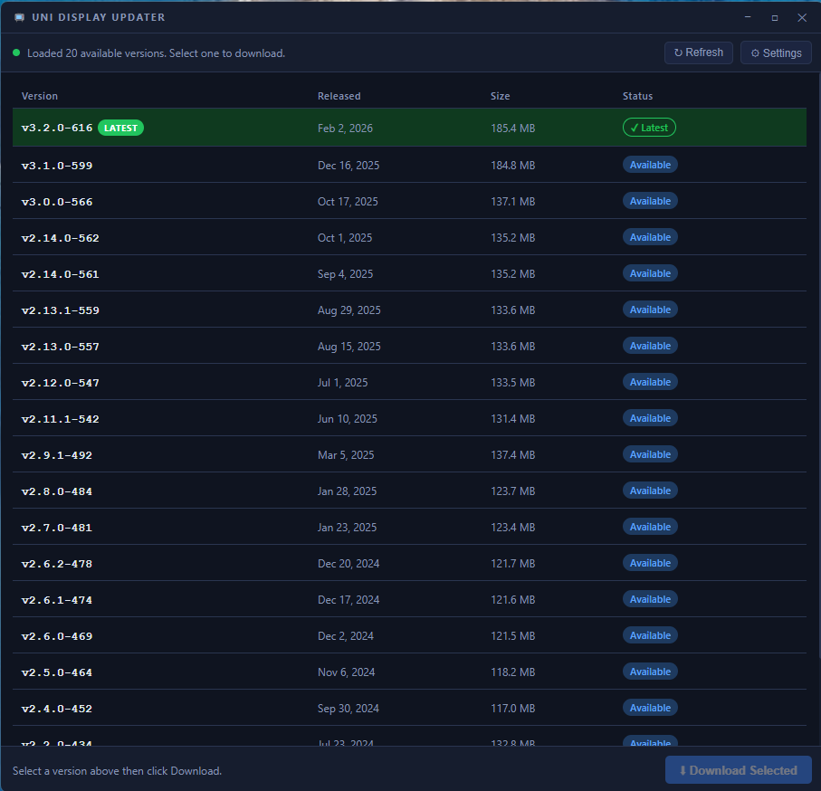

# New online version available: https://unifi_fix.damon1974.com/
# Thanks.

---------------------------

# UniFi Connect Display — Protect App Manual Update Fix

> **Community workaround** — not affiliated with Ubiquiti.  
> Tested on UDM Pro running UniFi Connect 3.24.14 with UC Display, UC Display 7, and UC Display 13.

---

> 🚀 **Uni Display Updater app now available!** A portable Windows and macOS app that makes this entire process point-and-click. Download it from the [Releases](https://github.com/Hackpig1974/unifi-connect-display-fix/releases/latest) page.

[](https://ko-fi.com/hackpig1974)

---



---

## The Problem

UC Displays get stuck on old versions of the UniFi Protect app. The console shows an available update, but the displays never reboot or install it. No error is shown in the WebUI — it just silently fails.

## Why It Happens

After SSH investigation of a UDM Pro — including the firmware directory, PostgreSQL database, and Ubiquiti's firmware API — here is my best theory of what is happening:

- The console **correctly downloads** the latest Protect APK from Ubiquiti's servers — the file is valid and uncorrupted
- The console then tries to **push** the file to the displays over its management channel
- That push mechanism is **broken** — the display never receives or installs the file
- The WebUI **manual upload** path uses a completely different code path that **works correctly** — it parses the APK, registers it in PostgreSQL, and the display fetches it successfully

**The fix:** Download the APK directly from Ubiquiti and upload it through the WebUI. Same file, working code path.

---

## Option 1 — Uni Display Updater App (Easiest)

Download the portable app from the [Releases](https://github.com/Hackpig1974/unifi-connect-display-fix/releases/latest) page.

### What it does
- Fetches all available Protect app versions directly from Ubiquiti's firmware API
- Shows versions in a clean list with the latest clearly marked
- One-click download with a progress bar
- Saves files with friendly names like `protect-android-app-3.2.0-616.apk`
- Opens your UniFi Connect WebUI automatically after download
- Guides you through the exact upload steps

### Setup
1. Download `UniDisplayUpdater-portable.exe` (Windows) or `UniDisplayUpdater.dmg` (macOS)
2. Run the app — no installation required
3. Click ⚙ **Settings** and configure:
   - **Console IP Address** — your UDM Pro IP (e.g. `192.168.1.1`)
   - **Download Folder** — where APK files will be saved
4. Click **↻ Refresh** to load available versions
5. Select the latest version and click **⬇ Download Selected**
6. After download, click **📤 Upload to UniFi Connect** — your browser opens to your console
7. Follow the on-screen steps shown in the app

### After the browser opens — what to do in UniFi Connect
1. Log in if prompted
2. Click on a **Display** in the device list to open its detail panel
3. Click the **⚙ gear icon** in the right panel
4. Verify **Display Mode is set to Android App**, then click **Manage Apps**
5. Click the **upload icon** (box with arrow, top right of the dialog)
6. Navigate to your download folder and select the APK file
7. After upload, close Manage Apps and select the new version in the **App dropdown**
8. The display will reboot and install the update ✅

---

## Option 2 — Simple Method (No App, No SSH)

### 1 — Find the Latest Version

Open this URL in your browser:

```
https://fw-update.ubnt.com/api/firmware?filter=eq~~product~~protect-android-app&filter=eq~~platform~~android-app&filter=eq~~channel~~release&limit=20&sort=-created
```

Look for the first entry and find the `href` field inside `_links > data`. It will look like:

```
https://fw-download.ubnt.com/data/protect-android-app/e3a3-android-app-3.2.0-616-...apk
```

### 2 — Download the APK

Paste that URL directly into your browser and download the file (130–200 MB).

### 3 — Upload and Install

Follow **steps 1–8** from the app instructions above (starting at "After the browser opens").

---

## Option 3 — SSH Method (Advanced)

Use this if you want to verify the file the console already downloaded or prefer the command line.

### Step 1 — Enable SSH

1. Go to **Settings → System → SSH** in your UniFi OS WebUI
2. Enable SSH and set a password — note it, you will need it
3. Connect: `ssh root@<your-console-ip>` — password is what you set above

### Step 2 — Check Available Versions

```bash
curl -s "https://fw-update.ubnt.com/api/firmware?filter=eq~~product~~protect-android-app&filter=eq~~platform~~android-app&filter=eq~~channel~~release&limit=20&sort=-created" | python3 -c "
import json,sys
data=json.load(sys.stdin)
for f in data['_embedded']['firmware']:
    print('Version:', f['version'])
    print('URL:', f['_links']['data']['href'])
    print()
"
```

### Step 3 — Locate the Already-Downloaded APK

```bash
ls -la /volume1/.srv/unifi-connect/firmware/
```

Verify integrity — compare MD5 against the value from the API:

```bash
md5sum /volume1/.srv/unifi-connect/firmware/<filename>.apk
```

### Step 4 — Download (If Needed)

```bash
cd /volume1/.srv/unifi-connect/firmware/
curl -O "<paste the full URL from Step 2>"
```

### Step 5 — Copy to Your Computer

```cmd
scp root@<your-console-ip>:/volume1/.srv/unifi-connect/firmware/<filename>.apk C:\Users\<youruser>\Downloads\
```

### Step 6 — Upload and Install

Follow **steps 1–8** from the app instructions above (starting at "After the browser opens").

---

## Troubleshooting

**Upload rejected with "Unsupported Format"**  
Only plain `.apk` files are accepted. Do not use `.apkm` or `.apkx` bundles. Files from Ubiquiti's servers are plain APKs.

**Display does not reboot after selecting the new version**  
Refresh the WebUI and try again. Check logs via SSH: `tail -f /volume1/.srv/unifi-connect/log/apk.log`

**MD5 does not match**  
File is corrupt — delete and re-download.

**SSH connection refused**  
Verify SSH is enabled in **UniFi OS → Settings → System → SSH**. Username is `root`, password is the one set in that same section.

---

## Tested Environment

| Component | Version |
|-----------|---------|
| UniFi Connect | 3.24.14 |
| Protect App (before) | 1.21.0 |
| Protect App (after) | 3.2.0-616 |
| Hardware | UC Display, UC Display 7, UC Display 13 |
| Console | UDM Pro |

---

## Detailed Guide

A full Word document with extended background, root cause theory, and troubleshooting is included in this repository.

---

*Community guide — not affiliated with Ubiquiti. Use at your own risk.*

Made with ❤️ for the Claude.ai community
